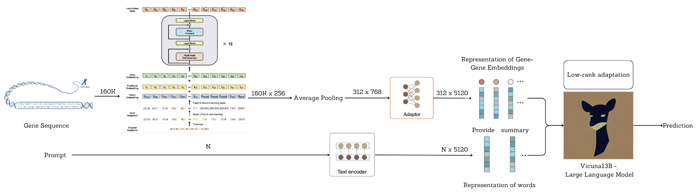

# GeneChat: Multi-Modal Large Language Model Enables Gene Function Prediction

This repository contains the code and data of GeneChat: Multi-Modal Large Language Model Enables Gene Function Prediction [Manuscript](https://www.biorxiv.org/content/10.1101/2025.06.05.658031v1).

<!--
## Examples

   

Examples of multi-round dialogues with ProteinChat for Q9U281, Q9XZG9, and Q9LU44.
-->

## Introduction
- GeneChat is a multi-modal large language model designed to predict gene descriptions from genomic sequences.
- GeneChat works in a similar way as ChatGPT. It takes as input the genomic sequence and predicts a description about the gene that includes which organism it might belong to, where it might be located and what it's functions are.
- The GeneChat model consists of a gene encoder, a large language model (LLM), and an adaptor. The gene encoder takes a genomic sequence as input and learns a representation for this gene. The adaptor transforms the gene representation produced by the gene encoder into LLM embedding space. The LLM takes the representation transformed by the adaptor and users' questions about this gene as inputs and generates answers. All these components are trained end-to-end. We use [DNABERT2](https://github.com/facebookresearch/esm) as the gene encoder.
- To train GeneChat, we designed (gene, prompt, answer) triplets from the NCBI dataset, resulting in ~51K genes.




## Getting Started
### Installation

**1. Prepare the code and the environment**

Git clone our repository, creating a python environment and ativate it via the following command

```bash
git clone https://github.com/Shashi-Sekar/GeneChat.git
cd GeneChat
conda env create -f environment.yml
conda activate genechat
```

Verify the installation of `torch` and `torchvision` is successful by running `python -c "import torchvision; print(torchvision.__version__)"`. If it outputs the version number without any warnings or errors, then you are good to go. __If it outputs any warnings or errors__, try to uninstall `torch` by `conda uninstall pytorch torchvision torchaudio cudatoolkit` and then reinstall them following [here](https://pytorch.org/get-started/previous-versions/#v1121). You need to find the correct command according to the CUDA version your GPU driver supports (check `nvidia-smi`). 

**2. Dataset**

The dataset contains 51,411 genes. It is curated from [NCBI](https://www.ncbi.nlm.nih.gov/gene). 
The collected data can be found on the drive [here](https://drive.google.com/drive/folders/1g0Pe0HxfzdhXWbG54rkd-Iya7c6wYZdO?usp=sharing)
You will see a `data` folder with two subfolders `train_set`, `test_set`.

**3. Prepare the pretrained Vicuna weights**

The current version of ProteinChat is built on Vicuna-13B-v1.5.
Please download Vicuna weights from [https://huggingface.co/lmsys/vicuna-13b-v1.5](https://huggingface.co/lmsys/vicuna-13b-v1.5).
Then, set the path to the vicuna weight in the config file
[configs/genechat_stage1.yaml](configs/genechat_stage1.yaml#L15).


### Dependency management (Intel XPU fork, `uv`)

This fork replaces the conda/CUDA setup above with [`uv`](https://docs.astral.sh/uv/) for Intel Arc XPU training, driven by `pyproject.toml`. Standard flow:

```bash
uv sync                    # install/update the environment from pyproject.toml
uv run python train_unsloth.py --cfg-path configs/genechat_unsloth_stage2.yaml
```

**Only declare what you actually import or need version control over.** `pyproject.toml`'s `dependencies` list is limited to packages this repo's code imports directly (`torch`, `transformers`, `torchvision`, `peft`, `einops`, `numpy`, `wandb`, `timm`, …) plus the XPU-critical training stack (`unsloth`, `unsloth-zoo`, `triton-xpu`, `pytorch-triton-xpu`, `torchao`). Everything else `unsloth`/`accelerate`/`transformers` need transitively (`bitsandbytes`, `datasets`, `sentencepiece`, `tokenizers`, `huggingface-hub`, `safetensors`, `pillow`, `trl`, `diffusers`, `cut-cross-entropy`, …) is deliberately left unpinned — maintaining our own version opinion on packages `unsloth` already controls is what caused a real `transformers`/`torch` resolution conflict during a `uv sync --upgrade` (see `[tool.uv] override-dependencies` in `pyproject.toml`). Checked with `uv tree --invert --package <name>` before removing anything.

**Two known XPU/uv gotchas, both documented as comments in `pyproject.toml`:**

1. **Resolver scope.** Without `[tool.uv] environments = ["sys_platform == 'linux'"]` and a bounded `requires-python`, `uv sync` tries to resolve a lockfile valid for every Python version/platform (e.g. win32 + Python 3.14), and fails there even though the actual target is Linux-only.
2. **Triton file collision.** `triton` (plain, pulled in transitively by `unsloth`/`unsloth-zoo`/`cut-cross-entropy`), `triton-xpu`, and `pytorch-triton-xpu` all install to the same path (`triton/_C/libtriton.so`). Whichever installs *last* wins the file-overwrite race, and a fresh `uv sync --upgrade` reliably lets plain `triton` win, breaking `import unsloth` with `ImportError: cannot import name 'intel' from 'triton._C.libtriton'`. Fix after any resolution that touches triton packages:
   ```bash
   uv sync --reinstall-package triton-xpu --reinstall-package pytorch-triton-xpu
   ```

Referenced when diagnosing both of these:
- vLLM's Intel XPU install guide — [`docs/getting_started/installation/gpu.xpu.inc.md`](https://github.com/vllm-project/vllm/raw/refs/heads/main/docs/getting_started/installation/gpu.xpu.inc.md) — documents the same plain-`triton`-vs-`triton-xpu` collision and the force-reinstall-last fix this project adopted.
- Unsloth's Intel GPU install guide — [unsloth.ai/docs/get-started/install/intel](https://unsloth.ai/docs/get-started/install/intel.md) — shows unsloth's own official install path pins exact wheel URLs (bypassing the resolver conflict entirely, at the cost of an older torch version); this project instead keeps our own newer torch/transformers via `override-dependencies` since the pinned versions are already verified working here.

### Training
**You need at least 70 GB GPU memory for the training.** 

The training configuration file is [configs/genechat_stage1.yaml](configs/genechat_stage1.yaml). In addition, you may want to change the number of epochs and other hyper-parameters there, such as `max_epoch`, `init_lr`, `min_lr`,`warmup_steps`, `batch_size_train`. Please adjust `iters_per_epoch` so that `iters_per_epoch` * `batch_size_train` = your training set size. 

Also, set your desired output directory [here](configs/proteinchat_stage1.yaml#53).

Start the training by running 
```bash
bash finetune.sh --cfg-path configs/genechat_stage1.yaml
``` 

### Evaluation

Modify the checkpoint paths in [configs/genechat_eval.yaml](configs/genechat_eval.yaml) to the location of your checkpoint.
We provide a stage1_ckpt [here](https://drive.google.com/drive/folders/1AaSzc9nlh_kfOJDuhLBfDHo3pGKrcKAE?usp=sharing) by training on 47,275 genes. peft_ckpt can be set empty during evaluation.

You can evaluate the model by running
```bash
bash demo.sh
``` 


## Acknowledgement

+ [DNABERT2](https://github.com/MAGICS-LAB/DNABERT_2)
+ [HyenaDNA](https://github.com/HazyResearch/hyena-dna)
+ [MiniGPT-4](https://minigpt-4.github.io/) 
+ [Lavis](https://github.com/salesforce/LAVIS)
+ [Vicuna](https://github.com/lm-sys/FastChat)


## License
This repository is under [BSD 3-Clause License](LICENSE.md).
